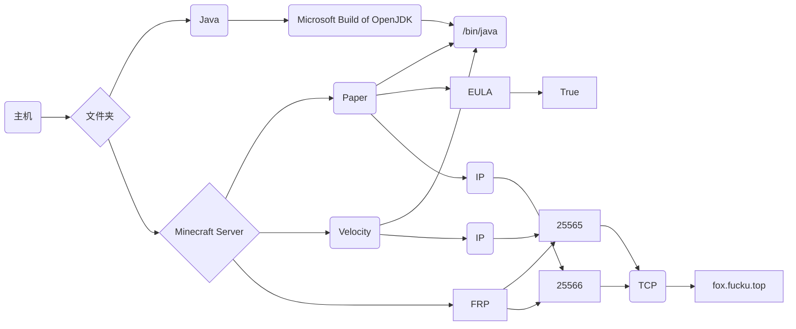

# Project Moonland X

## 服务器结构图

```mermaid
flowchart LR
b{文件夹}
c(Java)
d{Minecraft Server}
  a(主机) --> b
  b-->c
  b-->d
  c-->cc(Microsoft Build of OpenJDK)
  cc-->ccc(/bin/java)
  d-->dd(Paper)
  d-->Velocity(Velocity)
  d-->FRP
  dd-->ccc
  Velocity-->ccc
  dd-->EULA
  EULA-->True
  dd-->IP(IP)
  IP-->25566
  Velocity-->IP2(IP)
  IP2-->25565
  FRP-->25565
  FRP-->25566
  25565-->TCP(TCP)
  25566-->TCP
  TCP-->fox.fucku.top
  
```

